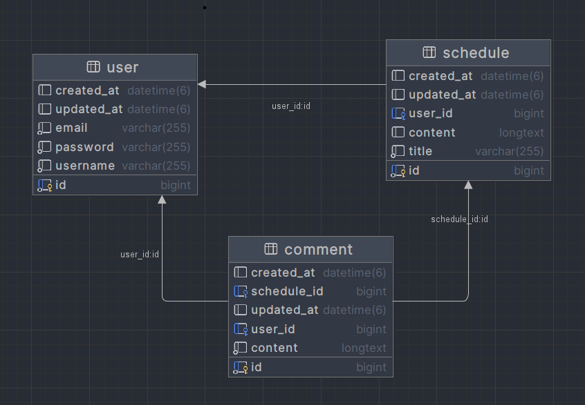

# 일정 관리 앱 만들기

### 프로젝트 소개

- 1 ~ 4단계 필수 기능 5 ~ 8단계 도전 기능의 각 요구사항에 따라 일정 관리 앱을 만든 프로젝트입니다.
---
### 프로젝트 목적
- Spring 숙련 학습 후, Spring 실습과 Validation, Session Login, Filter, Spring Data JPA 등의 활용을 목적으로 작성하였습니다.
---
### 개발 기간
- 25.05.15 ~ 25.05.25
---
### 프로젝트 요구사항
- 필수 기능
  - Lv 1. 일정 CRUD
    
    - 일정 생성(일정 작성하기)
      - 일정을 생성, 조회, 수정, 삭제할 수 있습니다.
      - 일정은 아래 필드를 가집니다.
        - 작성 유저명, 할일 제목, 할일 내용, 작성일, 수정일 필드
        - 작성일, 수정일 필드는 JPA Auditing을 활용합니다.
   
  - Lv 2. 유저 CRUD
    
      - 유저를 생성, 조회, 수정, 삭제할 수 있습니다. 
      - 유저는 아래와 같은 필드를 가집니다.
        - 유저명, 이메일, 작성일 , 수정일 필드
        - 작성일, 수정일 필드는 JPA Auditing을 활용합니다.
      - 연관관계 구현
        - 일정은 이제 작성 유저명 필드 대신 유저 고유 식별자 필드를 가집니다.
      
  - Lv 3. 회원가입
    
      - 유저에 비밀번호 필드를 추가합니다.
        - 비밀번호 암호화는 도전 기능에서 수행합니다.
     
  - Lv 4. 로그인(인증)
 
      - 설명
        -  Cookie/Session을 활용해 로그인 기능을 구현합니다.
        -  필터를 활용해 인증 처리를 할 수 있습니다.
        -  @Configuration 을 활용해 필터를 등록할 수 있습니다.
      -  조건
        -  이메일과 비밀번호를 활용해 로그인 기능을 구현합니다.
        -  회원가입, 로그인 요청은 인증 처리에서 제외합니다.
      -  예외처리
        -  로그인 시 이메일과 비밀번호가 일치하지 않을 경우 HTTP Status code 401을 반환합니다.
   
  - Lv 5. 다양한 예외처리 적용하기
    
      - Validation을 활용해 다양한 예외처리를 적용해 봅니다.
      - 정해진 예외처리 항목이 있는것이 아닌 프로젝트를 분석하고 예외사항을 지정해 봅니다.
        - Ex) 할일 제목은 10글자 이내, 유저명은 4글자 이내
        - @Pattern을 사용해서 회원 가입 Email 데이터 검증 등 
   
  - Lv 6. 비밀번호 암호화
    
    - Lv.3에서 추가한 비밀번호 필드에 들어가는 비밀번호를 암호화합니다.
      - 암호화를 위한 PasswordEncoder를 직접 만들어 사용합니다.
   
  - Lv 7. 댓글 CRUD
    - 생성한 일정에 댓글을 남길 수 있습니다.
      - 댓글과 일정은 연관관계를 가집니다. 
    - 댓글을 저장, 조회, 수정, 삭제할 수 있습니다.
    - 댓글은 아래와 같은 필드를 가집니다.
      - 댓글 내용, 작성일, 수정일, 유저 고유 식별자, 일정 고유 식별자 필드
      - 작성일, 수정일 필드는 JPA Auditing을 활용하여 적용합니다.
  - Lv 8. 일정 페이징 조회
    - 데이터베이스
      - offset / limit : SELECT 쿼리에 적용해서 데이터를 제한 범위에 맞게 조회할 수 있습니다.
    - 페이징
      - Pageable : Spring Data JPA에서 제공되는 페이징 관련 인터페이스 입니다.
      - PageRequest : Spring Data JPA에서 제공되는 페이지 요청 관련 클래스입니다.
    - 일정을 Spring Data JPA의 Pageable과 Page 인터페이스를 활용하여 페이지네이션을 구현
      - 페이지 번호와 페이지 크기를 쿼리 파라미터로 전달하여 요청하는 항목을 나타냅니다.
      - 할일 제목, 할일 내용, 댓글 개수, 일정 작성일, 일정 수정일, 일정 작성 유저명 필드를 조회합니다.
      - 디폴트 페이지 크기는 10으로 적용합니다.
    - 일정의 수정일을 기준으로 내림차순 정렬합니다.

---      
### API 명세서  

| 기능           | Method | URL                      | Request                         | Request 예시 | Response                       | Response 예시 | 상태코드       |
|----------------|--------|---------------------------|----------------------------------|---------------|-------------------------------|----------------|----------------|
| 일정 생성       | POST   | /api/schedules            | requestBody ㆍ할일 제목: String ㆍ할일 내용: String ㆍ유저명: String |  { "title": "spring project",  "content": "schedule develop",  "username": "김원준" } | 생성된 일정 정보 일정 ID : Long 할일 제목 : String 할일 내용 : String| response샘플  {"id" : 1, "title" : "spring project" "content" : "schedule develop" }|201 : 정상등록 |
| 일정 단건 조회   | GET    | /api/schedules/{id}       | requestParam 일정 ID : Long | /api/schedules/1|단건 일정 정보 할일 제목 : Stirng 할일 내용 : String 유저명 : String  | { "title" : "spring project", "content" : "schedule develop", "username" : "김원준" } | 200 : 정상조회 |
| 일정 전체 조회   | GET    | /api/schedules            | X                               | /api/schedules | 전체 일정 정보 리스트  [ { 일정 ID : Long 할일 제목 : String 할일 내용 : String } ]         | [ { "id" : 1, "title" : "spring project", "content" : "schedule develop" } ] | 200 : 정상조회 |
| 일정 페이징 조회 | GET  | /api/schedules/paged | requestParam  페이지 : int(기본값 0)  사이즈 : int(기본값 10) | /api/schedules/paged?page=0&size=5 | 페이징된 일정 리스트 Page SchedulePageResponseDto | [ { "content": [ { "id": 1,  "title": "spring project",  "username": "김원준"  },  {  "id": 2,  "title": "JPA 공부",  "username": "김원준"  }  ],  "pageable": {...},  "totalPages": 3,  "totalElements": 15 } ] | 200: 정상 조회
| 일정 수정       | PATCH  | /api/schedules/{id}       | requestBody 할일 내용 : String requestParam 일정ID     : Long | /api/schedules/1 { "content": "schedule develop2" } | X                             | 200 OK         | 200 : 정상수정 400 : 비밀번호 오류 |
| 일정 삭제       | DELETE | /api/schedules/{id}       | requestParam 일정ID    : Long | /api/schedules/1 | X                             | 200 OK         | 200 : 정상삭제 400 : 비밀번호 오류 |
| 유저 생성 | POST		| /api/signup  | requestBody 유저명 : String 이메일 : String 비밀번호 : String | {"name" : "김원준", "email" :	"example.com", "password" : "pw123" } | 생성된 유저 정보  유저 ID : Long 유저명 : String 이메일 : String | { "id" : 1, "name" : "김원준" "email" :	"example.com" } | 201 : 정상 등록
| 유저 단건 조회 | GET		| /api/users/{id} | requestParam 유저 ID : Long | /api/users/1 | 단건 유저 정보 유저명 : String 이메일 : String | { "name" : "김원준", "email" :	"example.com" } | 200 : 정상조회 404 : 조회실패
| 유저 전체 조회 | GET  | /api/users | X | /api/users | 전체 유저 정보 리스트  [ { 유저명 : String 이메일 : String } ] | [ { "name" : "김원준", "email" :	"example.com" } ] | 200 : 정상조회 404 : 조회실패
| 유저 수정	 | PATCH		| /api/users/{id} | requestBody 기존 비밀번호: String 새 비밀번호 : String requestParam 유저 ID : Long | /api/users/1 { "oldPassword" : "pw123", "newPassword" : "pw111" } | X | 200 OK | 200 : 정상수정
| 유저 삭제	 | DELETE		| /api/users/{id} | requestParam 유저 ID : Long | /api/users/1 | X | 200 OK | 200 : 정상삭제
| 로그인		| POST		| /api/login | requestBody 이메일 : String 비밀번호 : String | { "email" : "example.com", "password" : "pw123" } | 유저 정보	 유저 ID : Long | { "id" : 1 } | 200 : 정상 로그인 401 : 로그인 실패
| 댓글 생성	| POST		| /api/comments | requestBody 댓글 내용 : String | { "content" : "댓글 내용",  "userId" : 1, "scheduleId" : 1 } | 생성된 댓글 정보 댓글 ID : Long 댓글 내용 : String 유저 ID : Long 일정 ID : Long | { "id" : 1, "content" : "댓글 내용", "userId" : 1 "scheduleId" : 1 } | 201 : 정상생성
| 댓글 단건 조회 | GET		| /api/comments/{id} | requestParam 댓글 ID : Long | /api/comment/1 | 단건 댓글 정보 댓글 ID : String 댓글 내용 : String 유저명 : String | { "id" : 1, "content" : "댓글 내용", "username" : "김원준" } | 200 : 정상생성
| 댓글 전체 조회 | GET		| /api/comments | X			| /api/comments | 댓글 정보 리스트  [ { 댓글 ID : String 댓글 내용 : String 유저명 : String } ] | [ { "id" : 1, "content" : "댓글 내용", "username" : "김원준" } ] | 200 : 정상생성
| 댓글 수정	| PATCH		| /api/comments/{id} | requestBody		 댓글 내용 : String | { "content" : "댓글 내용2" } | X | 200 OK | 200 : 정상수정
| 댓글 삭제	| DELETE		| /api/comments/{id} | requestParam   댓글 ID	 | /api/comments/1 | X | 200 OK | 200 : 정상삭제

---      
### ERD

---
### 개발 환경
- IDE : IntelliJ, JDK : 17.0.10 버전 사용
  
---
### 사용된 기술
- 언어 : JAVA
- 프레임워크 : Spring
